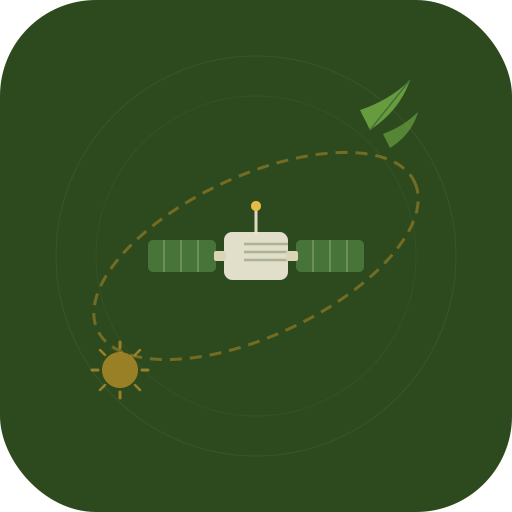

# Write with Nature 🌿🛰️

**Compose any text as NASA Landsat satellite imagery.**

Rivers, glaciers, dunes and coastlines — naturally shaped into letters by Earth itself, photographed from orbit over 50 years of the Landsat program. Type a word, a poem, an essay. Watch the planet spell it back.

&nbsp;



&nbsp;

## What it does

- Type any text (A–Z, spaces, multi-line) into the composer
- Each letter renders as a real NASA Landsat satellite scene — a river bend in Virginia, a glacier in Iceland, a salt pan in Namibia
- Click any tile to cycle through alternative scenes for that letter
- Shuffle all tiles at once for a new composition
- Download the full collage as a PNG
- Install as a PWA — works offline once images are cached

The page title itself is rendered in Landsat tiles. Every letter you see is a real place on Earth.

&nbsp;

## Aesthetic

Solarpunk · botanical illustration · retro-futurist. Warm parchment tones, Playfair Display italic headings, hand-drawn SVG vine dividers, paper grain texture. Designed to feel like a field journal from a hopeful future.

&nbsp;

## Live app

🌐 **[vegamorningstar.github.io/Write-With-Nature](https://vegamorningstar.github.io/Write-With-Nature/)**

&nbsp;

## Run locally

No build step. No npm. No framework.

```bash
git clone https://github.com/VegaMorningstar/Write-With-Nature
cd Write-With-Nature
python3 -m http.server 8080
```

Open [http://localhost:8080](http://localhost:8080)

&nbsp;

## Deploy

Push to `main` — GitHub Actions auto-deploys to GitHub Pages.

First time setup:
1. Go to repo **Settings → Pages**
2. Set Source to **GitHub Actions**
3. That's it. Next push goes live automatically.

&nbsp;

## Image data

Images are served from NASA's public domain CDN by default. No API key, no account needed.

To self-host (faster loads, full offline support):

```bash
pip install requests beautifulsoup4
python3 scripts/download_landsat_letters.py
```

Images download into `images/{LETTER}/` — one folder per letter of the alphabet. Then in `index.html`, flip:

```js
const USE_LOCAL = true;
```

&nbsp;

## File structure

```
Write-With-Nature/
│
├── index.html                        the entire app — HTML + CSS + JS
├── manifest.json                     PWA manifest
├── sw.js                             service worker (shell + image caching)
├── icon.svg / icon-192.png / icon-512.png
│
├── images/                           satellite tile library
│   ├── A/
│   │   ├── a-1-Hickman-Kentucky.png
│   │   ├── a-2-Farm-Island-Maine.png
│   │   └── ...
│   ├── B/ … Z/
│   └── README.md                     naming convention + ML pipeline notes
│
├── scripts/
│   └── download_landsat_letters.py   bulk-downloads NASA tiles into images/
│
├── .github/
│   └── workflows/
│       └── pages.yml                 auto-deploy to GitHub Pages
│
├── CLAUDE.md                         project context for Claude Code (VS Code)
└── README.md                         ← you are here
```

&nbsp;

## Adding more letter variants

1. Drop a PNG into `images/{LETTER}/` using the naming convention:
   `{lowercase-letter}-{n}-{Location-Name}.png`
   e.g. `a-5-Nile-Delta-Egypt.png`

2. Add an entry to the `LETTERS` object in `index.html`:

```js
A: [
  ...existing entries...,
  { url: u('A', 'a-5-Nile-Delta-Egypt.png'), label: 'Nile Delta, Egypt' },
],
```

See [`images/README.md`](images/README.md) for the full naming spec.

&nbsp;

## Roadmap

### Phase 1 — NASA image set ✅
Hand-curated Landsat scenes from NASA's *Your Name in Landsat* project.
One to four variants per letter, A–Z.

### Phase 2 — Expanded library
Download the full NASA gallery (~100+ scenes) using the included script.
Self-host for faster loads and full offline support.

### Phase 3 — ML letter detection
Train a shape-detection model on the full Landsat archive (50+ years,
petabytes of imagery via `s3://usgs-landsat` on AWS) to automatically
find landforms that resemble letters. Pipeline:

1. Sample Landsat Collection 2 tiles from the AWS public dataset
2. Run CNN / contour detection to score each tile for letter resemblance
3. Filter high-confidence hits, crop to square, export PNG
4. Auto-sort into `images/{LETTER}/` following the naming convention
5. Add entries to `LETTERS` in `index.html`

The goal: hundreds of variants per letter, sourced entirely from Earth.

### Phase 4 — Sharing
- Shareable URLs that encode text + tile selections
- QR code export
- "Remix" a shared collage

&nbsp;

## Image credits

All satellite imagery sourced from NASA's
[Your Name in Landsat](https://science.nasa.gov/mission/landsat/outreach/your-name-in-landsat/)
project. Images © NASA / USGS — **public domain**.

The Landsat program is a joint NASA and U.S. Geological Survey mission
that has been continuously photographing Earth's surface since 1972 —
the longest-running satellite record of our planet.

&nbsp;

## Contributing

This is a solo creative project but PRs are welcome for:
- New letter variant images (follow the naming convention)
- Bug fixes
- Accessibility improvements

&nbsp;

---

*Made with Earth, from orbit.*
